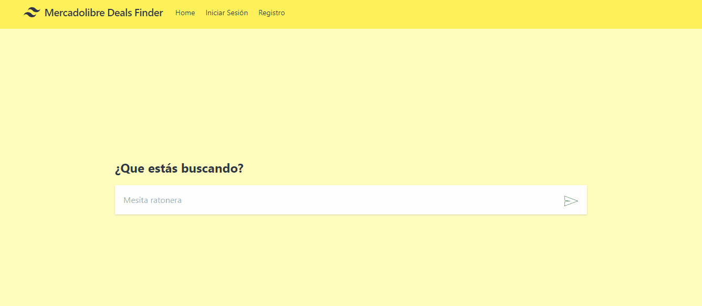

# Mercadolibre Deals Finder

This is a tool for searching items within Mercadolibre Argentina, but allowing us to filter by multiple regions, this way you can search in multiple locations at the same time, instead of doing 1 search per location.

Live demo: https://mldealsfinder.herokuapp.com/

### Technologies used

- Laravel
- Vue Js
- Tailwind
- Axios
- Placeholder loading

### To Do

- [x] Home
- [x] Basic search
- [x] Advanced search (Filters)
- [x] Login/Register

### Note

There are some bugs and maybe the pagination could be a lot more polished, also the vue components could be better built and the laravel dependencies in the controllers aren't well done (use DI over Facades). This is just an educational project. 